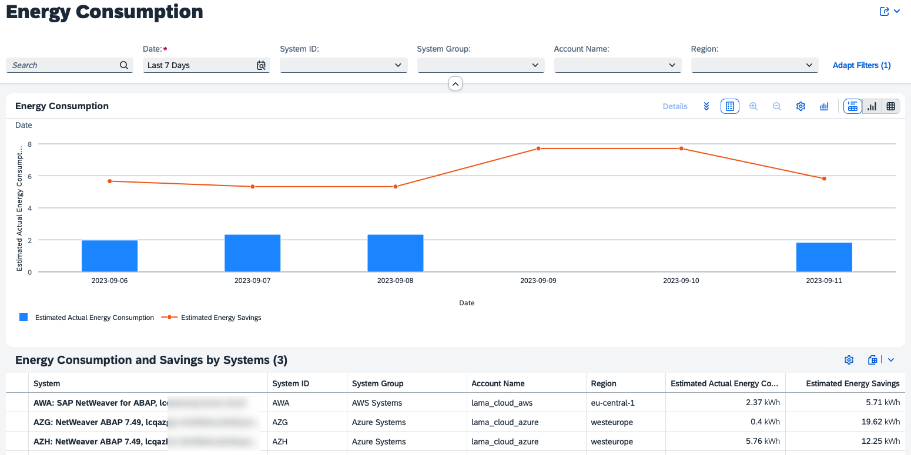
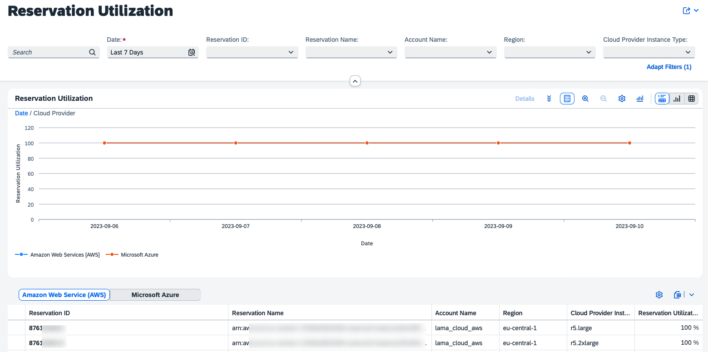

# Exercise 2 - Automate landscape activities and save infrastructure costs

In this exercise, you will create patterns and apply them to system groups so that you can save (virtual) money. Furthermore, you will get to know the analytics capabilities of SAP Landscape Management Cloud.

## Exercise 2.1 Create a pattern 

After completing these steps you will have created a pattern to start and stop systems at dedicated times on a repatitive schedule. Furthermore, you will prepare to scale-in systems which should stay available, but have lesser load over the weekend.

1. Select `Automation Studio > Patterns` to find a list of already created patterns. 
2. If you decide that none of the pre-shipped patterns fulfil your team's working schedule, you can create a new pattern. Therefore, select `Create` next to the table header.
3. Provide the pattern name "Development".
4. Keep the pattern type as "ongoing".
5. Lets live in a dream world where the development team only needs their systems Monday to Thursday for 10 hours and Fridays until 2pm. Therefore, shift your attention to the "Time Slots" section.
6. Keep the "Target Status" at "Running".
7. Provide as "Start/End Time" `07:00` to `19:00`.
8. As "Occurence" click on `F, S, S` to unselect the days Friday to Sunday.
9. Select `Add` above this section for an individual schedule for Fridays. A new area will appear on top. 
10. Keep the "Target Status" as "Running". 
11. Provide times for starting and stopping `07:00` to `15:00`.
12. As "Occurence" click on `M, T, W, T, S, S` to unselect all days but Friday.
13. At the end of the section, select `Create`.

After creating the pattern "Development", select the pattern "Weekends Scaled In". This pattern will keep at least one application server instance alive, but will stop unused ones. The ABAP Central Services instance is running as well as all database instances.

## Exercise 2.2 Optimize system availability to save infrastructure cost.

After completing these steps you will have optimized system availability and you can save virtual infrastructure cost.

1. In the navigation to the left, select `Landscape Management > Optimization`.
2. Select the system group "Development".
3. In the section to the right, select the checkbox next to the table header "Status / Name".
4. At the top right, select `Operations > Apply Pattern`. 
5. Expand the drop down "New Pattern" and select `Development`. You can instantly see how much infrastructure cost you are estimated to save when stopping the development systems during the night and over the weekend. Furthermore, it's indicated how much energy is saved by applying the pattern. 
6. Select `Apply` to actiavte this pattern.

Now lets scale in the production systems on a regular basis:
1. Select the system group "Production". 
2. In the section to the right, select the checkbox next to the table header "Status / Name".
3. At the top right, select `Operations > Apply Pattern`. 
4. Expand the drop down "New Pattern" and select `Weekends Scaled In`.
5. Move to the tab `Selected Entities` and expand both systems by selecting the `>` arrow next to their names.
6. For one of the two listed application servers, open the drop down and check the box next to `Scaled In (...)`. Don't select the patterns for both application servers as one needs to stay available. 
7. Navigating back to `Pattern Settings`, you can see a little savings in infrastructure costs.
8. Select `Apply` to close this pop-up.

When you navigate back to `Home`, you can now see an overview of the estimated savings for your whole landscape managed with SAP Landscape Management Cloud.

## Exercise 2.3 Analyze SAP landscape data in detail

SAP Landscape Management Cloud includes analytical capabilities in three main dimensions: infrastructure cost, energy consumption, and usage of reserved infrastructure. The data for these analytics is fetched from the supported cloud providers and stored by the solution. Data for systems managed on the level of "basic usage" is kept for 90 days. Data for systems in the "advanced usage" state is kept without a  timely limit.

As your trial tenant of SAP Landscape Management Cloud is not using a real account of any cloud provider, no analytics capabilities are available. There is a video elaborating on what's possible in the production environment. 

Here is what you can find for these three dimensions.

### Costs

### Energy Consumption

### Reservation Utilization

## Summary

🎉 Congratulations! You've now applied patterns to system groups to reduce infrastructure cost and analyzed how much you can actually save. 

Continue to - [Exercise 3 - Setup alerts for unforseen situations](../ex3/README.md)
