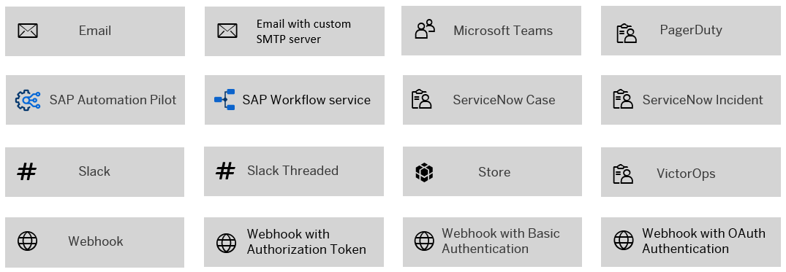

# Exercise 3 - Setup alerts for unforeseen situations

In this exercise, you will connect SAP Landscape Management Cloud with SAP Alert Notification Service for SAP BTP from within your SAP BTP trial account. Imagine you are a SAP Basis Administrator and you want to automatically get notified in case unforseen problems occur when managing your SAP landscape. In that case, you want to instantly get this information instead of seeing it upon your next logon into SAP Landscape Management Cloud. That's what SAP Alert Notification Service is all about. Its so-called "Actions" can send information if a certain condition has materialized. Here is a list of all channels that can be served by Actions:



([Source](https://help.sap.com/docs/alert-notification/sap-alert-notification-for-sap-btp/managing-actions?locale=en-US))

Therefore, you will setup an instance of SAP Alert Notification Service, generate credentials, and add them to SAP Landscape Management Cloud. This will allow you to forward the business events for triggering an action.

## Exercise 3.1 Get familiar with business events of SAP Landscape Management Cloud

After completing these steps, you will know about the business events SAP Landscape Management Cloud can emit. Events are standardized messages that help shifting from tightly coupled point-to-point integrations towards loosely coupled event-based integrations supports a reduction in this integration complexity. SAP Landscape Management Cloud can generate events in case activities are executed, finished, or failed when it comes to starting, stopping, and discovering new SAP systems in the connected IaaS accounts. 

Review the available [SAP Landscape Management Cloud operation events](https://api.sap.com/package/SAPLandscapeManagementCloudBusinessEvents/event) in the SAP Business Accelerator Hub before continuing the following exercise steps.

1. Select `Operations Events`.
2. Select the tab `Event References`.
3. You can find the three available business events at the left side. All refer to an activity triggered within SAP Landscape Management Cloud:

   - "ce/sap/lmc/Activity/STARTSERVICE/v1": A system is being started.
   - "ce/sap/lmc/Activity/STOPSERVICE/v1": A system is being stopped. 
   - "ce/sap/lmc/Activity/DISCOVERY/v1": SAP Landscape Management Cloud checks the Hyperscaler accounts for new systems to manage.

4. Expand the `Payload` area in the grey box to find the information which is sent with each event. Besides the "activityId" for a later use in combination with the REST API endpoints, the "status" field is very relevant. This indicates if the respective activity has just started **executing**, **successfull**y finished, or **failed**.

## Exercise 3.2 Create an instance of SAP Alert Notification Service
 
After completing these steps, you will have setup an instance of SAP Alert Notification Service and generated a service key which you will use inside SAP Landscape Management Cloud.

1. Open your [SAP BTP Trial account](https://account.hanatrial.ondemand.com/trial/#/home/trial).
2. Select `Go To Your Trial Account`. 
3. Select the subaccount `trial`. 
4. Select `Services > Service Marketplace`. 
5. Scroll down to the section "Foundation / Cross Services" and select `Alert Notification`.
6. Select `Create` at the top right to open the instance creation wizard.
7. Change the "Runtime Environment" selection to `Cloud Foundry`.
8. Provide an instance name e.g. "ansForLama" and select `Next`.

Now that you've create a service instance, lets continue by generating a service key:

9. Select `Instances and Subscriptions` in the left navigation.
10. In the area "Instances", select the line item for Alert Notification, e.g. `ansforlama` (not yet the link of that row).
11. On the right side, select `create` in the lower section titled "Service Keys".
12. Provide a "Service Key Name", e.g. `ansbinding`.
13. Select `Create`.

Now you can see your created binding in the table. When you select the entry you will see a JSON similar to this one:

```JSON
{
    "url": "https://lorem-ipsum.cfapps.us10.hana.ondemand.com",
    "client_id": "sb-abcd4e23-8dbb-08e0070725d8!b1235|ans-xsuaa!b673",
    "client_secret": "something-something-4fdc-a426-a08a8b1128da$feojt1R4zxfjJbyl3osVYN6iYZVYaY-VNRygYMKgxwQ=",
    "oauth_url": "https://subdomain.authentication.us10.hana.ondemand.com/oauth/token?grant_type=client_credentials"
}
```

14. Select `Download` to keep them for later.

## Exercise 3.3 Enable SAP Landscape Management Cloud to emit events to SAP Alert Notification Service

After completing these steps, SAP Landscape Management Cloud will be able to send events to SAP Alert Notification Service. You will use the [integration with CloudEvents Publishers](https://help.sap.com/docs/alert-notification/sap-alert-notification-for-sap-btp/integrating-with-cloudevents-publishers?locale=en-US) provided by SAP Alert Notification Service.

1. Inside SAP Landscape Management Cloud, select `Event Routing` in the left navigation.
2. Select the `Create` button.
3. In the area which opens at the right, provide an "Event Broker Name" like "Alert Notifications".
4. In the dropdown list "Event Broker Type", select `SAP Alert Notification Service`.
5. Use the `Import` button next to "Credentials File" and upload the *.txt or *.json file you downloaded in step 14 of exercise 3.2.
6. Append the following to the provided content of the "API URL" field:

```
/cf/producer/v1/resource-events?schema_definition=cloud_events&version=1.0
```

The API URL should look similar to 

```
https://cf-eu10.cfapps.sap.hana.ondemand.com/cf/producer/v1/resource-events?schema_definition=cloud_events&version=1.0
```

7. Ensure that "Activate Event Broker" is set to active.
8. Select `Create` at the bottom right of the screen.


## Exercise 3.4 Configure actions and conditions for email alerts

At the end of this section, "System Stop"-activities in SAP Landscape Management Cloud will trigger an email to your inbox via SAP Alert Notification.

1. Open your SAP BTP trial account.
2. Select the subsccount.
3. On the left, select `Services > Instances and Subscriptions`.
4. In the table "Instances", select the "Instance" name of SAP Alert Notification service, e.g. called "ansforlama". This will open the user interface in a new browser tab.

### Exercise 3.4.1 Create an Action

At the end of this section, you have configured SAP Alert Notification service to send emails into your inbox.

1. Select `Actions` on the left.
2. Select `Create`.
3. Select `Email` as "Action Type".
4. Select `Next`.
5. Provide any value as "Name", e.g. "SendEmailAction".
6. Provide your email address in the field "Email Address".
7. Provide any email subject for "Subject Template", e.g. "ANS for LaMa".
8. In the "Payload Template" field, paste the following for receiving the event payload via email

```
{body | limit (1500)}
```

9. Select `Create` at the bottom of the pop-up.

This setup will trigger an email to the provided email address with the subject "[ACTION REQUIRED] SAP Alert Notification service for SAP BTP. Confirmation Token: [..]".

10. Open the email and follow the provided link.
11. Select `Confirm` to accept receiving emails from SAP Alert Notification service.

### Exercise 3.4.2 Create a Condition

At the end of this section, you have created the condition for receiving an email when an operation to stop a managed system is triggered, has finished, or failed. 

1. Select `Conditions` on the left side. 
2. Select `Create`.
3. Provide any "Name", e.g. "StopService".
4. As "Condition", select `eventType`. Even though the header field inside the payload of the [CloudEvent emitted by SAP Landscape Management Cloud](https://api.sap.com/event/OperationEvents/resource) is called "type", [the field is mapped](https://help.sap.com/docs/alert-notification/sap-alert-notification-for-sap-btp/integrating-with-cloudevents-publishers?locale=en-US#context) by SAP Alert Notification service to "eventType".
5. Ensure that the selected value of the dropdown list in the middle is `Contains`.
6. As "Expected value..." provide `STOPSERVICE`.
7. Select `Create` at the bottom of the page.

### Exercise 3.4.3 Create a Subscription

At the end of this section, you have joined the condition with the action to trigger email actions when the condition is met.

1. Select `Subscriptions` on the left side.
2. Select `Create`. 
3. Provide a "Name", e.g. "MyAlert".
4. Select `Create`.
5. Select the checkbox next to the condition you created, e.g. "StopService".
6. Select the condition in the "Selected Conditions" field, e.g. "Contains STOPSERVICE".
7. Select `Assign`.
8. Check the checkbox next to the available Action you created, e.g. "SendEmailAction".
9. Select `Assign`.
10. Select `Close`. 

You will now see the newly created subscription in the tiles.

## Exercise 3.5 Try out the notification

At the end of this section, you will have received an email when stopping a system. 

1. Open your trial account of SAP Landscape Management Cloud.
2. On the left, select `Operations`.
3. For any system listed in the "Systems" table which has a green ✅ next to its name, select `...` on the right side of the line item.
4.  Select `Instance Operations`.
5.  Select `Stop`.
6.  Select `Next Step`.
7.  Select `Perform Operation`.

This will stop the particular system and trigger the business event "STOPSERVICE" which will trigger the configured alert. 

## Summary

🎉 Congratulations! Now you have setup alerts for a particular situation in your SAP system landscape.

Continue to - [Exercise 4 - Create scripts to trigger landscape management tasks](../ex4/README.md)
